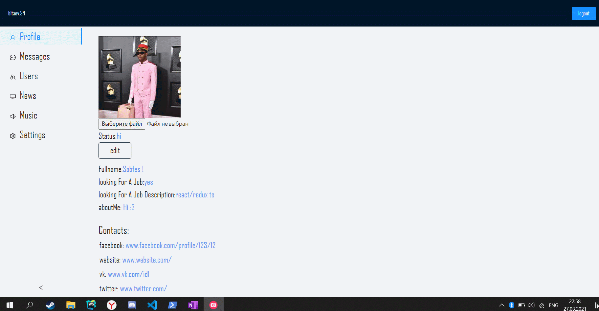

# TypeScript - React/Redux SocNet
##Установка
Перед началом работы необходимо проверить наличие установленного node.js и npm

Скопируйте проект на компьютер:
git clone https://github.com/Sabfes/Soc-net.git

Установите зависимости:
npm install

## Запуск приложения:
npm run start
По дефолту сервер запустится на 3000 порту

###[DEMO version](https://sabfes.github.io/wgg-test-task/)
